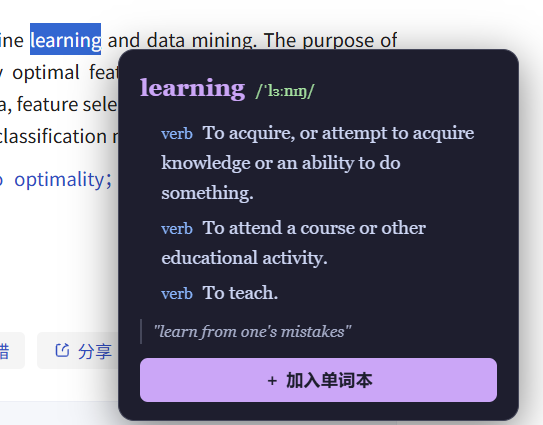
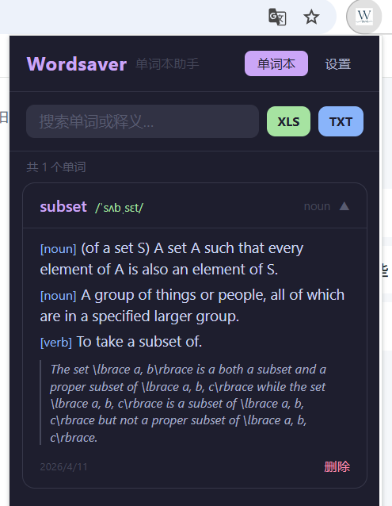
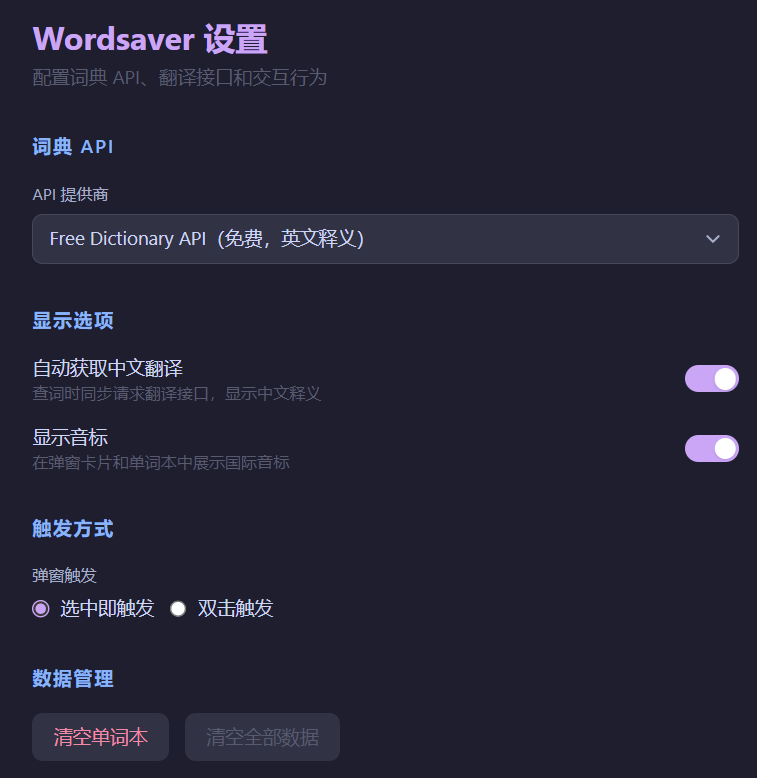

# WordSaver ✦ 单词本助手

WordSaver 是一款基于 Chrome Manifest V3 的轻量级划词翻译与生词本扩展程序。

*效果预览*

   
 
 
 
 

## ✨ 核心功能

* **📖 沉浸式划词查词**：支持鼠标选中或双击触发，在当前网页原生弹出单词释义卡片，不打断阅读心流。
* **🧠 多数据源支持**：内置 Free Dictionary API (英英释义)，并支持接入有道词典和 DeepL 翻译 API。
* **🗂️ 结构化单词本**：自动记录单词的音标、词性、精准释义、例句以及被添加的来源网页。
* **📤 灵活导出**：支持一键将单词本导出为 `.xlsx` (Excel) 或 `.txt` 格式，方便进行后期复习或导入到 Markdown 笔记软件中排版成册。

## 🛠️ 技术栈

本项目采用现代化的前端工程流构建：

* **核心框架**: React 18
* **开发语言**: TypeScript
* **样式方案**: Tailwind CSS
* **构建工具**: Vite (配合原生 Rollup 分包策略)
* **插件标准**: Chrome Extension Manifest V3
* **数据持久化**: `chrome.storage.local`

## 📦 如何安装与使用 (适合普通用户)

如果你只是想使用这款插件，请按照以下步骤操作：

1. **下载插件包**：获取最新版本的 `WordSaver.zip` 安装包并解压到一个固定的文件夹中（请不要删除该文件夹）。
2. **打开扩展页面**：在基于 Chrome 内核的浏览器地址栏输入 `chrome://extensions/` 并回车。
3. **开启开发者模式**：在页面右上角打开 **“开发者模式” (Developer mode)** 的开关。
4. **加载插件**：点击页面左上角的 **“加载已解压的扩展程序” (Load unpacked)** 按钮。
5. **选择文件夹**：选中你刚才解压出来的 `dist` 文件夹（或解压后的根目录），即可安装成功！
6. **固定到任务栏**：点击浏览器右上角的“拼图”图标，将 WordSaver 固定到工具栏。打开任意一个真实的网页刷新后，即可体验划词翻译。

## 🛠️ 本地开发与构建 (适合开发者)

本项目采用现代化的前端工程流构建 (React + TypeScript + Tailwind CSS + Vite)。

### 1. 安装依赖
确保已安装 [Node.js](https://nodejs.org/) 和 pnpm。在项目根目录运行：
\`\`\`bash
pnpm install
\`\`\`

### 2. 编译打包
执行构建命令，Vite 会将 TypeScript 和 React 代码编译并输出到 `dist` 目录：
\`\`\`bash
pnpm run build
\`\`\`
打包完成后，`dist` 目录即为可被 Chrome 浏览器直接加载的插件本体。

### 3. 打包发布
如果想打包分享给其他人，只需将 `dist` 文件夹右键压缩为 `.zip` 文件即可。

## ⚙️ 目录结构说明

\`\`\`text
wordsaver/
├── public/                 # 静态资源 (Manifest, CSS, 图标等)
├── src/
│   ├── background/         # Service Worker (处理 API 请求与数据调度)
│   ├── content/            # Content Script (注入网页的划词监听与 UI)
│   ├── options/            # 插件设置页 (配置 API Key、交互方式)
│   ├── popup/              # 插件弹窗页 (单词本列表、搜索、导出)
│   ├── types/              # TypeScript 类型定义
│   └── word.ts             # 核心数据结构接口
├── popup.html              # 弹窗 HTML 骨架
├── options.html            # 设置页 HTML 骨架
├── vite.config.ts          # Vite 构建配置
└── tailwind.config.js      # Tailwind CSS 配置
\`\`\`

## 🔒 隐私与数据安全

WordSaver 秉持本地优先 (Local-First) 的原则。你的所有单词本数据均安全地存放在浏览器本地的 SQLite 数据库 (`chrome.storage.local`) 中，不会被上传至任何第三方服务器。

***
## 待完成

1. 增加内置词典，按需自行导入（支持json、txt、csv、mdx）
2. 去重复
3. 多个单词本，分类保存（或者采用tag的方式）

